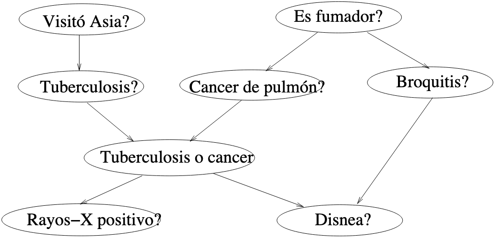
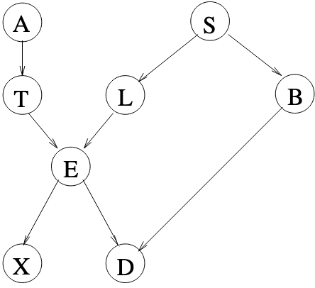

```{r}
library(bnlearn)
library(gRain)
```

## Ejercicio 1

**Hacer un script en R para construir la red bayesiana (DAG y tablas de probabilidad) usada como ejemplo en esta práctica. El script debe contener también los comandos para dibujar la red bayesiana y para hacer las consultas (d-separación, probabilidad a posteriori) que se han explicado en la sección 7.3 usando el método de inferencia exacto y los dos aproximados.**


```{r}
dag <- empty.graph(
    nodes = c("A", "S", "E", "O", "R", "T")
)

modelstring(dag) <- "[A][S][E|A:S][O|E][R|E][T|O:R]"
graphviz.plot(dag)

A.st <- c("young", "adult", "old")
S.st <- c("M", "F")
E.st <- c("high", "uni")
O.st <- c("emp", "self")
R.st <- c("small", "big")
T.st <- c("car", "train", "other")


A.prob <- array(c(0.30, 0.50, 0.20), dim=3, dimnames = list(A = A.st))
S.prob <- array(c(0.60, 0.40), dim=2, dimnames = list(S = S.st))
O.prob <- array(
    c(
        0.96, 0.04,
        0.92, 0.08
    ),
    dim=c(2,2),
    dimnames = list(O = O.st, E = E.st)
)
R.prob <- array(
    c(
        0.25, 0.75,
        0.20, 0.80
    ),
    dim = c(2,2),
    dimnames = list(R = R.st, E = E.st)
)
E.prob <- array(
    c(
        0.75, 0.25, 0.72,
        0.28, 0.88, 0.12,
        0.64, 0.36, 0.70,
        0.30, 0.90, 0.10
    ),
    dim=c(2, 3, 2),
    dimnames = list(E = E.st, A = A.st, S = S.st)
)

T.prob <- array(
    c(
        0.48, 0.42,
        0.10, 0.56,
        0.36, 0.08,
        0.58, 0.24,
        0.18, 0.70,
        0.21, 0.09
    ),
    dim=c(3, 2, 2),
    dimnames = list(`T` = T.st, O = O.st, R = R.st)
)

cpt <- list(
    A=A.prob,
    S=S.prob,
    E=E.prob,
    O=O.prob,
    R=R.prob,
    `T`=T.prob
)

bn <- custom.fit(dag, cpt)
bn
```

## Ejercicio 2

**Construye un script en R para construir la red Asia (Dag y tablas de probabilidad)**



**Usaremos los siguientes nombres para las variables:**

- Variable Visitó Asia: A
- Variable Es fumador: S
- Variable Tuberculosis: T
- Variable Cáncer de pulmón: L
- Variable Tuberculosis o cáncer de pulmón: E
- Variable Bronquitis: B
- Variable Rayos X positivo: X
- Variable Disnea: D

**Con estos nombres, la red bayesiana quedaría de la siguiente forma:**



**Todas las variables tienen dos estados: yes y no. Los valores de probabilidad son los siguientes:**

- P(A=yes) = 0.1
- P(T=yes|A=yes) = 0.05
- P(T=yes|A=no) = 0.01
- P(S=yes) = 0.5
- P(L=yes|S=yes) = 0.1
- P(L=yes|S=no) = 0.01
- P(B=yes|S=yes) = 0.6
- P(B=yes|S=no) = 0.3
- P(E=yes|L=yes, T=yes) = 1
- P(E=yes|L=yes, T=no) = 1
- P(E=yes|L=no, T=yes) = 1
- P(E=yes|L=no, T=no) = 0
- P(X=yes|E=yes) = 0.98
- P(X=yes|E=no) = 0.05
- P(D=yes|E=yes, B=yes) = 0.9
- P(E=yes|E=yes, B=no) = 0.7
- P(E=yes|E=no, B=yes) = 0.8
- P(E=yes|E=no, B=no) = 0.1

```{r}
dag2 <- empty.graph(
  nodes = c("A", "S", "T", "L", "E", "B", "X", "D")
)

modelstring(dag2) <- "[A][S][T|A][L|S][B|S][E|T:L][X|E][D|E:B]"
graphviz.plot(dag2)

state <- c("yes", "no")

A.probability <- array(
  c(0.1, 0.9),
  dim = 2,
  dimnames = list(A = state)
)

S.probability <- array(
  c(0.5, 0.5),
  dim = 2,
  dimnames = list(S = state)
)

T.probability <- array(
  c(
    0.05, 0.95,
    0.01, 0.99
  ),
  dim = c(2, 2),
  dimnames = list(`T` = state, A = state)
)

L.probability <- array(
  c(
    0.1, 0.9,
    0.01, 0.99
  ),
  dim = c(2, 2),
  dimnames = list(L = state, S = state)
)

B.probability <- array(
  c(
    0.6, 0.4,
    0.3, 0.7
  ),
  dim = c(2, 2),
  dimnames = list(B = state, S = state)
)

E.probability <- array(
  c(
    1, 0,
    1, 0,
    1, 0,
    0, 1
  ),
  dim = c(2, 2, 2),
  dimnames = list(E = state, L = state, `T` = state)
)

X.probability <- array(
  c(
    0.98, 0.02,
    0.05, 0.95
  ),
  dim = c(2, 2),
  dimnames = list(X = state, E = state)
)

D.probability <- array(
  c(
    0.9, 0.1,
    0.8, 0.2,
    0.7, 0.3,
    0.1, 0.9
  ),
  dim = c(2, 2, 2),
  dimnames = list(D = state, E = state, B = state)
)

cpt2 <- list(
    A=A.probability,
    S=S.probability,
    `T`=T.probability,
    L=L.probability,
    B=B.probability,
    E=E.probability,
    X=X.probability,
    D=D.probability
)

bn2 <- custom.fit(dag2, cpt2)
junction2 <- compile(as.grain(bn2))
bn2
```

**El script debe también hacer consultas para obtener lo siguiente:**

1. **Tablas de probabilidad marginal de padecer tuberculosis, de padecer cáncer de pulmón y de padecer bronquitis. Usa el método exacto y los dos aproximados.**

```{r}
exercise1.exact_method <- querygrain(
  junction2,
  nodes = c("T", "L", "B"),
  type = "marginal"
)

exercise1.t.approximated.ls <- cpquery(
  bn2,
  event = (`T` == "yes"),
  evidence = TRUE,
  method = "ls"
)
exercise1.l.approximated.ls <- cpquery(
  bn2,
  event = (L == "yes"),
  evidence = TRUE,
  method = "ls"
)
exercise1.b.approximated.ls <- cpquery(
  bn2,
  event = (B == "yes"),
  evidence = TRUE,
  method = "ls"
)

exercise1.approximated_method.ls <- list(
  `T` = array(
    c(exercise1.t.approximated.ls, abs(exercise1.t.approximated.ls - 1)),
    dim = 2,
    dimnames = list(`T` = state)
  ),
  L = array(
    c(exercise1.l.approximated.ls, abs(exercise1.l.approximated.ls - 1)),
    dim = 2,
    dimnames = list(L = state)
  ),
  B = array(
    c(exercise1.b.approximated.ls, abs(exercise1.b.approximated.ls - 1)),
    dim = 2,
    dimnames = list(B = state)
  )
)

exercise1.t.approximated.lw <- cpquery(
  bn2,
  event = (`T` == "yes"),
  evidence = TRUE,
  method = "lw"
)
exercise1.l.approximated.lw <- cpquery(
  bn2,
  event = (L == "yes"),
  evidence = TRUE,
  method = "lw"
)
exercise1.b.approximated.lw <- cpquery(
  bn2,
  event = (B == "yes"),
  evidence = TRUE,
  method = "lw"
)

exercise1.approximated_method.lw <- list(
  `T` = array(
    c(exercise1.t.approximated.lw, abs(exercise1.t.approximated.lw - 1)),
    dim = 2,
    dimnames = list(`T` = state)
  ),
  L = array(
    c(exercise1.l.approximated.lw, abs(exercise1.l.approximated.lw - 1)),
    dim = 2,
    dimnames = list(L = state)
  ),
  B = array(
    c(exercise1.b.approximated.lw, abs(exercise1.b.approximated.lw - 1)),
    dim = 2,
    dimnames = list(B = state)
  )
)

exercise1.exact_method
exercise1.approximated_method.ls
exercise1.approximated_method.lw
```

2. **Tablas de probabilidad marginal a posteriori de padecer cada una de las tres enfermedades anteriores dado que se sabe que el paciente visitó Asia. Usa el método exacto y los dos aproximados.**

```{r}
exercise2.evidence <- setEvidence(
  junction2,
  nodes = "A",
  states = "yes"
)
exercise2.exact_method <- querygrain(
  exercise2.evidence,
  nodes = c("T", "L", "B"),
  type = "marginal"
)

exercise2.t.approximated.ls <- cpquery(
  bn2,
  event = (`T` == "yes"),
  evidence = (A == "yes"),
  method = "ls"
)
exercise2.l.approximated.ls <- cpquery(
  bn2,
  event = (L == "yes"),
  evidence = (A == "yes"),
  method = "ls"
)
exercise2.b.approximated.ls <- cpquery(
  bn2,
  event = (B == "yes"),
  evidence = (A == "yes"),
  method = "ls"
)

exercise2.approximated_method.ls <- list(
  `T` = array(
    c(exercise2.t.approximated.ls, abs(exercise2.t.approximated.ls - 1)),
    dim = 2,
    dimnames = list(`T` = state)
  ),
  L = array(
    c(exercise2.l.approximated.ls, abs(exercise2.l.approximated.ls - 1)),
    dim = 2,
    dimnames = list(L = state)
  ),
  B = array(
    c(exercise2.b.approximated.ls, abs(exercise2.b.approximated.ls - 1)),
    dim = 2,
    dimnames = list(B = state)
  )
)

exercise2.t.approximated.lw <- cpquery(
  bn2,
  event = (`T` == "yes"),
  evidence = list(A = "yes"),
  method = "lw"
)
exercise2.l.approximated.lw <- cpquery(
  bn2,
  event = (L == "yes"),
  evidence = list(A = "yes"),
  method = "lw"
)
exercise2.b.approximated.lw <- cpquery(
  bn2,
  event = (B == "yes"),
  evidence = list(A = "yes"),
  method = "lw"
)

exercise2.approximated_method.lw <- list(
  `T` = array(
    c(exercise2.t.approximated.lw, abs(exercise2.t.approximated.lw - 1)),
    dim = 2,
    dimnames = list(`T` = state)
  ),
  L = array(
    c(exercise2.l.approximated.lw, abs(exercise2.l.approximated.lw - 1)),
    dim = 2,
    dimnames = list(L = state)
  ),
  B = array(
    c(exercise2.b.approximated.lw, abs(exercise2.b.approximated.lw - 1)),
    dim = 2,
    dimnames = list(B = state)
  )
)

exercise2.exact_method
exercise2.approximated_method.ls
exercise2.approximated_method.lw
```

3. **Tablas de probabilidad marginal a posteriori de padecer cada una de las tres enfermedades anteriores dado que se sabe que el paciente visitó Asia, y tiene disnea. Usa el método exacto y los dos aproximados**

```{r}
exercise3.evidence <- setEvidence(
  junction2,
  nodes = c("A", "D"),
  states = c("yes", "yes")
)
exercise3.exact_method <- querygrain(
  exercise3.evidence,
  nodes = c("T", "L", "B"),
  type = "marginal"
)

exercise3.t.approximated.ls <- cpquery(
  bn2, event = (`T` == "yes"),
  evidence = (A == "yes") & (D == "yes"),
  method = "ls"
)
exercise3.l.approximated.ls <- cpquery(
  bn2,
  event = (L == "yes"),
  evidence = (A == "yes") & (D == "yes"),
  method = "ls"
)
exercise3.b.approximated.ls <- cpquery(
  bn2,
  event = (B == "yes"),
  evidence = (A == "yes") & (D == "yes"),
  method = "ls"
)

exercise3.approximated_method.ls <- list(
  `T` = array(
    c(exercise3.t.approximated.ls, abs(exercise3.t.approximated.ls - 1)),
    dim = 2,
    dimnames = list(`T` = state)
  ),
  L = array(
    c(exercise3.l.approximated.ls, abs(exercise3.l.approximated.ls - 1)),
    dim = 2,
    dimnames = list(L = state)
  ),
  B = array(
    c(exercise3.b.approximated.ls, abs(exercise3.b.approximated.ls - 1)),
    dim = 2,
    dimnames = list(B = state)
  )
)

exercise3.t.approximated.lw <- cpquery(
  bn2,
  event = (`T` == "yes"),
  evidence = list(A = "yes", D = "yes"),
  method = "lw"
)
exercise3.l.approximated.lw <- cpquery(
  bn2,
  event = (L == "yes"),
  evidence = list(A = "yes", D = "yes"),
  method = "lw"
)
exercise3.b.approximated.lw <- cpquery(
  bn2,
  event = (B == "yes"),
  evidence = list(A = "yes", D = "yes"),
  method = "lw"
)

exercise3.approximated_method.lw <- list(
  `T` = array(
    c(exercise3.t.approximated.lw, abs(exercise3.t.approximated.lw - 1)),
    dim = 2,
    dimnames = list(`T` = state)
  ),
  L = array(
    c(exercise3.l.approximated.lw, abs(exercise3.l.approximated.lw - 1)),
    dim = 2,
    dimnames = list(L = state)
  ),
  B = array(
    c(exercise3.b.approximated.lw, abs(exercise3.b.approximated.lw - 1)),
    dim = 2,
    dimnames = list(B = state)
  )
)

exercise3.exact_method
exercise3.approximated_method.ls
exercise3.approximated_method.lw
```

4. **Tabla de probabilidad conjunta de padecer cáncer de pulmón y bronquitis. Indica cual es la probabilidad de la configuración más probable para las variables de estas dos enfermadades.**

```{r}
exercise4.LxB <- querygrain(
  junction2,
  nodes = c("L", "B"),
  type = "joint"
)
exercise4.LxB
```

La probabilidad de la configuración más probable es 0.5265, es decir, que no se padezca cáncer de pulmón ni bronquitis.

5. **Tabla de probabilidad conjunta de padecer cáncer de pulmón y bronquitis dado que el paciente no visitó Asia y el paciente es fumador. Indica cual es la probabilidad de la configuración más probable para las variables de estas dos enfermadades cuando el paciente no visitó Asia y el paciente es fumador.**

```{r}
exercice5.evidence <- setEvidence(
  junction2,
  nodes = c("A", "S"),
  states = c("no", "yes")
)

exercise5.LxB <- querygrain(
  exercice5.evidence,
  nodes = c("L", "B"),
  type = "joint"
)
exercise5.LxB
```

La probabilidad de la configuración más probable es 0.54, es decir, que no se padezca cáncer de pulmón pero si se padece de bronquitis.

6. **Si no se conoce el valor de ninguna variable, ¿qué comando(s) podemos usar para saber si visitar Asia influye en tener cáncer de pulmón o no?**

Se tiene que utilizar el comando dsep para ver si las dos variables son independientes. También se puede comprobar calculando
la probabilidad marginal de padecer cáncer de pulmón dado el visitar asia y no visitarlo.

```{r}
dsep(bn2, x = "A", y = "L")

exercise6.evidence <- setEvidence(
  junction2,
  nodes = "A",
  states = "yes"
)
querygrain(exercise6.evidence, nodes = "L")

querygrain(junction2, nodes = "L")
```

Como están d-separados, visitar Asia no influye en tener cáncer de pulmón. Además, como las probabilidades marginales son iguales,
se deduce que visitar asia no influye en padecer cáncer del pulmón.

7. **Sabiendo que el paciente es fumador, ¿qué comando(s) podemos usar para saber si dar positivo en una prueba de rayos X, puede influir en tener bronquitis?**

También se tiene que utilizar el comando dsep, para ver si las dos variables son independientes y en este caso el nodo de ser fumador se especifica como evidencia. También se puede comprobar calculando la probabilidad marginal de padecer bronquitis dado el ser fumador y dar positivo en la prueba de rayos x con respecto a ser fumador y dar negativo en la prueba.

```{r}
dsep(bn2, x = "X", y = "B", z = "S")

exercise7.evidence.1 <- setEvidence(
  junction2,
  nodes = c("S", "X"),
  states = c("yes", "yes")
)
querygrain(exercise7.evidence.1, nodes = "B")

exercise7.evidence.2 <- setEvidence(
  junction2,
  nodes = "S",
  states = "yes"
)
querygrain(exercise7.evidence.2, nodes = "B")
```

Como están d-separados conociendo el valor de S (ser fumador), dar positivo en una prueba de rayo X no influye en tener bronquitis. Además, como las probabilidades marginales son iguales, se deduce que dado ser fumador, dar positivo en una prueba de rayos X no influye en padecer bronquitis.

8. **La variable Tuberculosis o cáncer tiene asociada una distribución de probabilidad condicional que es una función determinista de los padres, concretamente una puerta or. Sabiendo que el paciente tiene tuberculosis, obtén las tablas de probabilidad marginal de padecer cáncer de pulmón y las tablas de probabilidad marginal a posteriori de padecer cáncer de pulmón si además se sabe que el paciente da positivo en la prueba de rayos X. ¿Puedes comentar si ha influido en la probabilidad de padecer cáncer de pulmón, el conocer que la prueba de rayos X ha sido positiva?**

```{r}
exercise8.evidence.1 <- setEvidence(
  junction2,
  nodes = "T",
  states = "yes"
)
querygrain(exercise8.evidence.1, nodes = "L")

exercise8.evidence.2 <- setEvidence(
  junction2,
  nodes = c("T", "X"),
  states = c("yes", "yes")
)
querygrain(exercise8.evidence.2, nodes = "L")
```

Como se puede observar, las probabilidades marginales no cambian, por lo que se puede afirmar que el conocer que la prueba de rayos X haya sido positiva no influye en la probabilidad de padecer cáncer de pulmón. Esto se debe principalmente al nodo E, que es un nodo determinista que depende de los nodos T y L. Como
se da el valor de T, E "bloquea" el camino entre X y L, y por lo tanto, el nodo X no influye en el nodo L.


## Ejercicio 3

**Como trabajo opcional de esta parte de la asignatura, se debe entregar un script en R para construir una red bayesiana de tamaño pequeño (mínimo 7 nodos). Podría entregarse la misma red que se haga para el trabajo a entregar a Manuel Gómez. Debe entregarse también un pequeño informe con la descripción del problema, y la descripción de la red (parte cualitativa y cuantitativa).**


**El script debe hacer lo siguiente:**

- **Construir el DAG de la red bayesiana**

```{r}

```

- **Crear las tablas de probabilidad**

```{r}

```

- **Hacer al menos tres consultas de la probabilidad a posteriori dada cierta evidencia, de alguna variable, usando el método exacto y los dos métodos aproximados.**

```{r}

```

- **Comprobar la d-separación en unos tres casos**

```{r}

```

